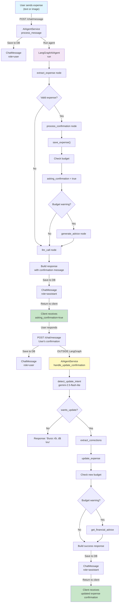

# Actual AI Agent Execution Flow

> **Last Updated**: November 26, 2025  
> **Status**: Current implementation differs from `ai_agent_analysis.md`

## Overview

The actual execution flow splits confirmation handling into **two separate execution contexts**:
1. **Initial message processing** runs within LangGraph
2. **Confirmation responses** are processed outside LangGraph by `AIAgentService`

---

## Phase 1: Initial Message Processing (LangGraph)

When user sends first message with expense information:

```
POST /v1/chat/{session_id}/message
    ↓
AIAgentService.process_message()
    ↓
LangGraphAIAgent.run()
    ├─ Node: extract_expense
    │   ├─ extract_expense_from_text() or extract_expense_from_image()
    │   └─ Validate extracted data
    │
    ├─ Router: _route_after_extraction
    │   └─ Valid expense? 
    │       ├─ YES → "process_confirmation"
    │       └─ NO → "llm_call"
    │
    ├─ Node: process_confirmation [IF valid]
    │   ├─ save_expense()
    │   ├─ auto-categorize if needed
    │   ├─ Check budget → budget_warning
    │   └─ Set asking_confirmation = true
    │
    ├─ Router: _route_after_confirmation
    │   └─ asking_confirmation == true?
    │       ├─ YES → Should route to "ask_confirmation" [CURRENTLY NOT IMPLEMENTED]
    │       └─ NO → Check budget_warning
    │           ├─ Has warning → "generate_advice"
    │           └─ No warning → "llm_call"
    │
    ├─ Node: generate_advice [IF budget_warning]
    │   └─ get_financial_advice()
    │
    └─ Node: llm_call
        └─ Format response to user
            ├─ Response text
            ├─ Extracted expense metadata
            ├─ Budget warning (if any)
            ├─ Financial advice (if any)
            ├─ saved_expense details
            └─ asking_confirmation = true

RETURNS: 
{
  "response": "Tôi đã lưu chi tiêu...",
  "asking_confirmation": true,
  "saved_expense": {...},
  "budget_warning": {...}
}
```

**Current Issue**: `ask_confirmation` node is defined but never executed in graph. Confirmation message is generated by `llm_call` node, not by `ask_confirmation` node.

---

## Phase 2: User Responds to Confirmation (Outside LangGraph)

This is **NOT** handled by LangGraph. User's response goes through `AIAgentService.handle_update_confirmation()`:

```
POST /v1/chat/{session_id}/message  [User's confirmation response]
    ↓
AIAgentService.process_message()
    ├─ Save user message to chat history
    ├─ Check if this is a confirmation response [Manual detection needed]
    │
    └─ If confirmation response:
        ↓
        AIAgentService.handle_update_confirmation()
            ├─ Call: detect_update_intent()
            │   ├─ Use gemini-2.5-flash-lite model
            │   ├─ Parse JSON response: {"wants_update": bool, "corrections": {...}}
            │   └─ Fallback: keyword matching if JSON parsing fails
            │
            ├─ If wants_update == false
            │   ├─ Response: "Được rồi, đã lưu"
            │   └─ END
            │
            ├─ If wants_update == true
            │   ├─ Extract corrections from message
            │   ├─ Call: expense_service.update_expense()
            │   │   └─ Apply corrections to database
            │   │
            │   ├─ Check new budget status
            │   │
            │   ├─ If new budget_warning
            │   │   └─ Call: advice_service.get_financial_advice()
            │   │
            │   └─ Build response with:
            │       ├─ Update confirmation message
            │       ├─ Updated values
            │       ├─ Budget warning (if any)
            │       └─ Financial advice (if any)
            │
            └─ RETURN: (response_text, corrections, budget_warning, financial_advice)

RETURNS:
{
  "response": "✅ Tôi đã cập nhật chi tiêu...",
  "budget_warning": {...},
  "financial_advice": {...}
}
```

---

## Message Flow Diagram



---

## State Management

### LangGraph AgentState (First Turn)
```python
{
    "messages": [HumanMessage(content="...")],
    "user_id": str,
    "session_id": str,
    "extracted_expense": Dict,
    "budget_warning": Dict,
    "financial_advice": Dict,
    "saved_expense": Dict,
    "asking_confirmation": bool,      # Set to True if expense saved
    "awaiting_user_response": bool,
    "db_session": Session
}
```

### Service-Level State (Second Turn)
```python
# handle_update_confirmation receives:
{
    "session_id": str,
    "user_message": str,
    "saved_expense": Dict,
    "user_id": str
}

# Returns:
{
    "response_text": str,
    "corrections": Optional[Dict],
    "budget_warning": Optional[Dict],
    "financial_advice": Optional[Dict]
}
```

---

## Node Status in Graph

| Node | Status | Called In | Purpose |
|------|--------|-----------|---------|
| `extract_expense` | ✅ Active | Entry point | Extract expense from user message |
| `process_confirmation` | ✅ Active | After extraction | Save expense to DB |
| `ask_confirmation` | ❌ Inactive | **Never called** | Was meant to ask user about changes |
| `detect_update_intent` | ⚠️ Outside graph | `handle_update_confirmation()` | Detect if user wants to update |
| `process_update` | ❌ Inactive | **Never called** | Was meant to apply corrections |
| `generate_advice` | ✅ Active | After confirmation | Generate financial advice |
| `llm_call` | ✅ Active | Multiple paths | Format final LLM response |

---

## Router Logic

### `_route_after_extraction(state)`
```python
if extracted_expense and validate_extracted_expense(extracted_expense):
    return "process_confirmation"
else:
    return "llm_call"  # Ask for clarification
```

### `_route_after_confirmation(state)`
```python
# Priority 1: Check if we just saved an expense
if state.get("asking_confirmation", False):
    # Should route to "ask_confirmation" but currently returns:
    return "ask_confirmation"  # This routing exists but path doesn't work properly

# Priority 2: Check for budget warning
if budget_warning:
    return "generate_advice"
else:
    return "llm_call"
```

**Issue**: The condition `if state.get("asking_confirmation", False)` returns `"ask_confirmation"`, but this node doesn't lead anywhere useful. The node exists but has no outgoing edges defined in the graph structure.

---

## Models Used

| Task | Model | Temperature | Purpose |
|------|-------|-------------|---------|
| Categorization | `gemini-2.5-flash` | 0.1 | Categorize expense into user's categories |
| Intent Detection | `gemini-2.5-flash-lite` | 0.1 | Detect update intent (faster, cheaper) |
| General Response | `gemini-2.5-flash` | 0.1 | Format final LLM response |

---

## Key Methods Flow

### AIAgentService Methods
```
process_message()
├─ Save user message
├─ langgraph_agent.run()
└─ Save AI response

handle_update_confirmation()
├─ detect_update_intent()
│   └─ Use gemini-2.5-flash-lite
├─ extract_corrections_from_message()  [Optional]
├─ expense_service.update_expense()
└─ advice_service.get_financial_advice() [If budget_warning]

detect_update_intent()
├─ Call gemini-2.5-flash-lite
├─ Parse JSON response
└─ Fallback to keyword matching

categorize_expense_with_llm()
├─ Get user's categories
├─ Call gemini-2.5-flash
└─ Extract category_id and confidence
```

### ExpenseProcessingService Methods
```
extract_expense_from_text()
├─ Heuristic parsing
└─ Return: {merchant_name, amount, date, description}

save_expense()
├─ Create Expense record
├─ Auto-categorize if needed (calls AIAgentService.categorize_expense_with_llm)
├─ Check budget
└─ Return: (Expense, budget_warning)

update_expense()
├─ Apply corrections
├─ Validate
├─ Check budget
└─ Return: (Expense, budget_warning)
```

---

## Database Operations

### Chat History Storage
- **ChatSession** (one per session)
  - user_id
  - session_title
  - status
  - created_at

- **ChatMessage** (one per turn)
  - session_id
  - role (user/assistant)
  - content
  - created_at

### Expense Storage
- **Expense**
  - user_id
  - merchant_name
  - amount
  - date
  - category_id
  - source_type (text/image)
  - confirmed_by_user (true after confirmation)

- **CategorizationFeedback** (when user corrects category)
  - expense_id
  - original_category_id
  - corrected_category_id
  - user_feedback

---

## Error Handling

### Fallback Mechanisms

1. **Intent Detection Parsing Failure**
   ```python
   # If JSON parsing fails in detect_update_intent():
   keywords_update = ["thay", "sửa", "đổi", "chỉnh", "lại", "khác", "sai"]
   wants_update = any(kw in user_message.lower() for kw in keywords_update)
   ```

2. **Categorization Failure**
   ```python
   # If LLM categorization fails:
   return None, None  # Returns no category suggestion
   ```

3. **Missing Session**
   ```python
   # If session not found:
   raise ValidationError(f"Chat session not found: {session_id}")
   ```

---

## Differences from Documentation

| Aspect | Documented | Actual |
|--------|-----------|--------|
| Confirmation handling | Inside LangGraph graph | Outside LangGraph in `AIAgentService` |
| `ask_confirmation` node | Routes to `detect_update_intent` | Defined but never routed to |
| `detect_update_intent` node | Inside graph | Inside `AIAgentService.detect_update_intent()` method |
| `process_update` node | Inside graph | Not used at all |
| Confirmation flow | Single graph execution | Two separate executions (graph + service) |
| Intent detection model | `gemini-2.5-flash-lite` | ✅ Correct |
| Update application | In graph node | In `AIAgentService.handle_update_confirmation()` |

---

## Improvements Needed

1. **Integrate confirmation flow into LangGraph**
   - Connect `ask_confirmation` → `detect_update_intent` → `process_update`
   - Remove duplicate logic from `AIAgentService`

2. **Add explicit confirmation detection**
   - Client should indicate second-turn messages explicitly
   - Or agent should track conversation context automatically

3. **Unify state management**
   - Move confirmation handling into LangGraph state
   - Remove service-level `handle_update_confirmation()` method

4. **Add multi-turn context**
   - Feed previous messages into `AgentState.messages`
   - Allow agent to understand conversation continuity

5. **Add confirmation timeout**
   - Expire confirmation requests after N minutes
   - Reset conversation if user doesn't respond

---

## Example Conversation

### Turn 1: User sends expense
```
User: "Tôi vừa mua cà phê 50000đ"

Graph Execution:
extract_expense → {merchant_name: "Cà phê", amount: 50000, date: "2025-11-26"}
↓
process_confirmation → save to DB, check budget
↓
generate_advice → (if budget warning)
↓
llm_call → Format response

Response:
{
  "response": "Tôi đã lưu chi tiêu...",
  "asking_confirmation": true,
  "saved_expense": {
    "id": "exp-123",
    "merchant_name": "Cà phê",
    "amount": 50000,
    "date": "2025-11-26",
    "category_id": "cat-001"
  }
}
```

### Turn 2: User responds to confirmation
```
User: "Sửa số tiền thành 60000"

Outside Graph:
detect_update_intent → wants_update=true, corrections={amount: 60000}
↓
update_expense → Update DB record
↓
generate_advice → (if budget warning)

Response:
{
  "response": "✅ Tôi đã cập nhật chi tiêu...",
  "budget_warning": {...}
}
```

---

## Implementation Files

- **LangGraph Agent**: `src/core/langgraph_agent.py`
  - Graph definition: `_build_graph()`
  - Node implementations: `_extract_expense()`, `_process_expense_confirmation()`, etc.
  - Routing logic: `_route_after_extraction()`, `_route_after_confirmation()`

- **AI Agent Service**: `src/services/ai_agent_service.py`
  - `process_message()` - Main entry point
  - `handle_update_confirmation()` - Confirmation flow
  - `detect_update_intent()` - Intent detection
  - `categorize_expense_with_llm()` - LLM categorization

- **Expense Service**: `src/services/expense_processing_service.py`
  - `extract_expense_from_text()` - Text extraction
  - `extract_expense_from_image()` - Image extraction
  - `save_expense()` - Save to DB
  - `update_expense()` - Apply corrections

- **Router**: `src/api/routes/chat_router.py`
  - `POST /v1/chat/start` - Start session
  - `POST /v1/chat/{session_id}/message` - Send message
  - `GET /v1/chat/{session_id}/history` - Get history
  - `POST /v1/chat/{session_id}/close` - Close session
