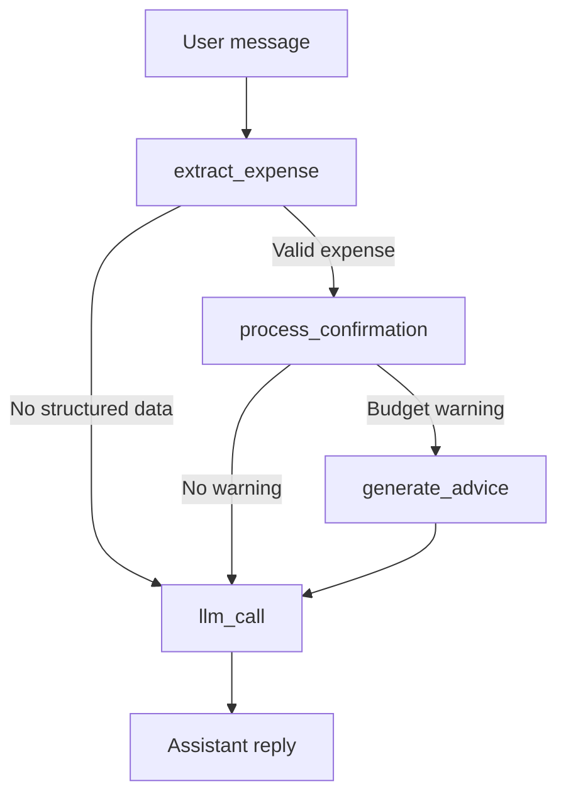

# AI Agent Operating Guide

## Overview
- Conversational expense tracking is delivered by `AIAgentService`, `LangGraphAIAgent`, and a set of domain services (`ExpenseProcessingService`, `BudgetManagementService`, `FinancialAdviceService`).
- The agent accepts text or image messages, extracts structured expenses, checks budgets, and returns actionable replies. Gemini 2.5 Flash provides both OCR and lightweight reasoning.
- All chat traffic is stored in `ChatSession` and `ChatMessage` tables; confirmed expenses flow into the standard expense pipeline and inherit budget/advice automation.

## Component Responsibilities
- **AIAgentService**  
  - Session lifecycle (`start_session`, `close_session`, `get_session_history`).  
  - Message orchestration: saves the user message, invokes LangGraph, persists the AI reply, and assembles the response payload.  
  - Correction support: `handle_correction_request` prompts Gemini to translate free-form corrections into a JSON payload before applying them through `ExpenseProcessingService`.
- **LangGraphAIAgent**  
  - Implements a `StateGraph` with `extract_expense`, `process_confirmation`, `generate_advice`, and `llm_call` nodes.  
  - Binds schema-aware tools to the Gemini model so the LLM can hand control to deterministic functions when it recognises structured intents.
- **ExpenseProcessingService**  
  - Heuristic extraction from plain text (`extract_expense_from_text`) and OCR outputs.  
  - Persists expenses, applies corrections, and records `CategorizationFeedback` when user adjustments occur.
- **BudgetManagementService / FinancialAdviceService**  
  - Budget checks and summarisation invoked post-confirmation to generate warnings.  
  - Spending analysis plus optional Gemini-backed financial advice.
- **Chat Schemas**  
  - `ChatMessageResponse` exposes the assistant reply, extracted expense metadata, optional budget warning message, and advice text.  
  - `ExtractedExpenseInfo` captures merchant, amount, date, confidence, and a suggested category.

## Conversation Lifecycle
1. **Session Start**  
   - `POST /v1/chat/start` creates `ChatSession` and returns a fixed onboarding prompt.  
   - No LangGraph call occurs at this point.
2. **Message Handling** (`POST /v1/chat/{session}/message`)  
   - Persist the user input as `ChatMessage(role="user")`.  
   - Run `LangGraphAIAgent` with the message, user identity, and session context.  
   - Persist the assistant reply; return any extracted expense, warning, or advice derived by the graph.
3. **Confirmation / Correction**  
   - `handle_correction_request` uses Gemini to parse corrections into JSON.  
   - Confirmed corrections update the stored expense and store optional learning artefacts.  
   - Endpoint `POST /v1/chat/{session}/confirm-expense` currently only returns placeholders; persistence wiring is planned.
4. **Session History & Closure**  
   - History endpoint marshals ORM objects into DTOs.  
   - Closing a session sets status to `completed` without deleting chat history.

## LangGraph Workflow

- `extract_expense`: calls `ExpenseProcessingService` heuristics for text or image payloads.  
- `_route_after_extraction`: routes to confirmation only when the extracted data passes validation.  
- `process_confirmation`: saves expenses and calls the budget service.  
- `generate_advice`: asks `FinancialAdviceService` for contextual guidance when a warning is raised.  
- `llm_call`: default Gemini response path when no structured intent is recognised; also finalises the assistant reply.

## Data Persistence
- **Expenses**: `ExpenseProcessingService.save_expense` commits new entries with `confirmed_by_user=False` until the user confirms. Manual creation via `/v1/expenses` skips the AI flow and stores confirmed entries directly.  
- **Feedback**: Corrections trigger `_store_correction_learning`, producing `CategorizationFeedback` rows used by rule learning.  
- **Chat**: Every user and assistant turn is stored; this enables future analytics and auditing.

## Error Handling & Safeguards
- Missing sessions raise `ValidationError`, returning a 422 with `VALIDATION_ERROR`.  
- Gemini parsing failures fall back to generic clarifying prompts instead of returning raw stack traces.  
- `get_current_user` allows a mock token in development only (`mock-token-for-development`), simplifying local agent testing.

## Limitations & Improvement Ideas
1. **Correction endpoint**: `/chat/{session}/confirm-expense` currently returns stub data and should reuse expense persistence once available.  
2. **Multi-turn memory**: LangGraph currently processes the latest message only; feeding previous turns into `AgentState.messages` would improve continuity.  
3. **Tooling feedback**: Capture node decisions (which tool fired, why) to aid agent debugging.  
4. **Async workloads**: OCR and long-running advice generation execute inline; offloading to a background queue would free the request thread.  
5. **Safety rails**: Add rate limiting and content filtering before passing user text to the LLM.  
6. **Evaluation harness**: Record interactions plus user confirmations to measure extraction accuracy over time.
