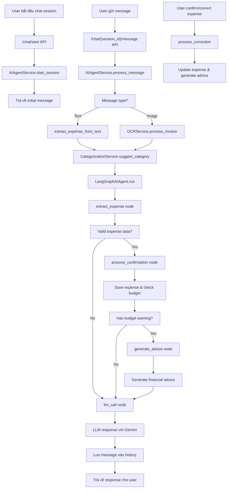

# Phân Tích Luồng Hoạt Động của AI Agent trong Moniagent

## Tổng Quan

Moniagent là một ứng dụng quản lý chi tiêu cá nhân sử dụng AI để tự động hóa việc theo dõi và phân loại chi tiêu. AI Agent trong hệ thống sử dụng LangGraph framework kết hợp với Google Gemini 2.5 để xử lý các cuộc hội thoại về chi tiêu, trích xuất thông tin từ hóa đơn, và cung cấp lời khuyên tài chính.

## Kiến Trúc Chính

- **Backend**: FastAPI microservice với Python 3.10+
- **Database**: Supabase (PostgreSQL) cho dữ liệu người dùng và chi tiêu
- **AI Stack**:
  - LangGraph: Framework để xây dựng agent workflows
  - Google Gemini 2.5: OCR và xử lý ngôn ngữ tự nhiên
  - LangChain: Tích hợp các components AI

## Luồng Hoạt Động Chính

## Chi Tiết Các Components

### 1. AIAgentService
- **Chức năng**: Quản lý các cuộc hội thoại AI-powered
- **Phương thức chính**:
  - `start_session()`: Khởi tạo session mới
  - `process_message()`: Xử lý message và generate response
  - `process_correction()`: Xử lý sửa đổi chi tiêu
  - `get_session_history()`: Lấy lịch sử hội thoại

### 2. LangGraphAIAgent
- **Framework**: Sử dụng StateGraph để xây dựng workflow
- **Nodes chính**:
  - `extract_expense`: Trích xuất thông tin chi tiêu từ message
  - `process_confirmation`: Xác nhận và lưu chi tiêu
  - `generate_advice`: Tạo lời khuyên tài chính
  - `llm_call`: Gọi LLM để generate response

### 3. OCRService
- **Công nghệ**: Google Gemini 2.5 Vision
- **Chức năng**: Trích xuất thông tin từ hình ảnh hóa đơn
- **Output**: store_name, date, total_amount

### 4. CategorizationService
- **Phương pháp**: Rule-based matching với confidence scores
- **Loại rules**: exact_match, keyword, regex
- **Learning**: Ghi nhận feedback để cải thiện categorization

### 5. ExpenseProcessingService
- **Chức năng**: Xử lý logic chi tiêu
- **Tích hợp**: Budget checking, financial advice generation

## Điểm Mạnh Hiện Tại

1. **Tích hợp tốt**: Kết hợp OCR, NLP, và rule-based systems
2. **Modular architecture**: Dễ mở rộng và maintain
3. **Real-time processing**: Xử lý ngay lập tức
4. **Learning capability**: Học từ user corrections

## Đề Xuất Hướng Phát Triển AI Agent

### 1. Cải Thiện Conversation Flow
- **Multi-turn memory**: Lưu trữ context dài hạn cho conversations phức tạp
- **Intent recognition**: Phân biệt giữa query thông tin vs. báo cáo chi tiêu
- **Proactive suggestions**: Tự động đề xuất categories hoặc detect patterns

### 2. Nâng Cao AI Capabilities
- **Advanced NLP**: Sử dụng RAG (Retrieval-Augmented Generation) cho personalized responses
- **Sentiment analysis**: Phân tích cảm xúc trong financial decisions
- **Predictive analytics**: Dự đoán spending patterns và alert sớm

### 3. Tích Hợp External Services
- **Bank APIs**: Tự động import transactions từ ngân hàng
- **Investment APIs**: Đề xuất đầu tư dựa trên spending habits
- **Market data**: Cung cấp insights về inflation và market trends

### 4. Enhanced Personalization
- **User profiling**: Xây dựng personality profiles cho advice phù hợp
- **Goal-based planning**: Hỗ trợ financial goals (saving for vacation, debt payoff)
- **Peer comparison**: Anonymous benchmarking với similar users

### 5. Technical Improvements
- **Hybrid AI**: Kết hợp multiple LLMs cho different tasks
- **Edge computing**: Process sensitive data locally
- **Real-time collaboration**: Multi-user expense tracking

### 6. Advanced Features
- **Voice interface**: Integration với voice assistants
- **AR receipt scanning**: Augmented reality cho scanning receipts
- **Blockchain integration**: Immutable expense records

### 7. Business Intelligence
- **Analytics dashboard**: Advanced reporting với AI insights
- **Anomaly detection**: Detect fraudulent transactions
- **Tax optimization**: Automated tax deduction suggestions

## Roadmap Phát Triển

### Phase 1 (3 tháng)
- Implement multi-turn conversations
- Add basic predictive analytics
- Improve OCR accuracy với custom training

### Phase 2 (6 tháng)
- Integrate bank APIs
- Add investment suggestions
- Launch mobile app với voice features

### Phase 3 (12 tháng)
- Full AI financial advisor
- Multi-currency support
- Enterprise features cho small businesses

## Kết Luận

AI Agent hiện tại của Moniagent đã có foundation vững chắc với architecture modular và tích hợp tốt các AI technologies. Các đề xuất phát triển tập trung vào việc nâng cao personalization, mở rộng capabilities, và tạo value lớn hơn cho users thông qua advanced AI features.
