# AI Agent Operating Guide

## Overview
- Conversational expense tracking is delivered by `AIAgentService`, `LangGraphAIAgent`, and a set of domain services (`ExpenseProcessingService`, `BudgetManagementService`, `FinancialAdviceService`).
- The agent accepts text or image messages, extracts structured expenses, checks budgets, and returns actionable replies. Gemini 2.5 Flash provides both OCR and lightweight reasoning.
- **NEW**: After saving an expense, the agent asks for confirmation and can process corrections using intent detection with `gemini-2.5-flash-lite` model.
- All chat traffic is stored in `ChatSession` and `ChatMessage` tables; confirmed expenses flow into the standard expense pipeline and inherit budget/advice automation.

## Component Responsibilities
- **AIAgentService**  
  - Session lifecycle (`start_session`, `close_session`, `get_session_history`).  
  - Message orchestration: saves the user message, invokes LangGraph, persists the AI reply, and assembles the response payload.  
  - **LLM Categorization** (`categorize_expense_with_llm`): Sends merchant name, amount, and description to Gemini 2.5 Flash with all user's Vietnamese categories listed in the prompt. Returns category_id and confidence_score.
  - **Confirmation & Update Handling**:
    - `handle_update_confirmation`: Applies the confirmation reply logic (intent detection + correction execution) outside the LangGraph run.
    - `detect_update_intent`: Uses `gemini-2.5-flash-lite` to determine if user wants to update the expense and extract corrections.
    - `extract_corrections_from_message`: Extracts structured correction details (merchant_name, amount, date) from user message.
  - Correction support: `handle_correction_request` prompts Gemini to translate free-form corrections into a JSON payload before applying them through `ExpenseProcessingService`.
- **LangGraphAIAgent**  
  - The compiled `StateGraph` actively routes `extract_expense → process_confirmation → ask_confirmation → llm_call`, with `generate_advice` injecting budget insights before the final LLM reply. `detect_update_intent` and `process_update` nodes are defined in code but currently are not connected to the graph, so they never execute during runtime.
  - Confirmation messaging inside the graph stops at `ask_confirmation`; the follow-up update loop is handled by `AIAgentService.handle_update_confirmation`.
  - Binds schema-aware tools to the Gemini model so the LLM can hand control to deterministic functions when it recognises structured intents.
- **ExpenseProcessingService**  
  - Heuristic extraction from plain text (`extract_expense_from_text`) and OCR outputs with **LLM-based categorization** support.  
  - Persists expenses, applies corrections, and records `CategorizationFeedback` when user adjustments occur.
  - When category_id is not provided, automatically calls `categorize_expense_with_llm()` for intelligent categorization.
- **BudgetManagementService / FinancialAdviceService**  
  - Budget checks and summarisation invoked post-confirmation to generate warnings.  
  - Spending analysis plus optional Gemini-backed financial advice.
- **Chat Schemas**  
  - `ChatMessageResponse` exposes the assistant reply, extracted expense metadata, optional budget warning message, advice text, **asking_confirmation flag, and saved_expense details**.
  - `ExtractedExpenseInfo` captures merchant, amount, date, confidence, **suggested_category_id, suggested_category_name**, and **categorization_confidence**.

## Conversation Lifecycle
1. **Session Start**  
   - `POST /v1/chat/start` creates `ChatSession` and returns a fixed onboarding prompt.  
   - No LangGraph call occurs at this point.
2. **Message Handling** (`POST /v1/chat/{session}/message`)  
   - Persist the user input as `ChatMessage(role="user")`.  
   - Run `LangGraphAIAgent` with the message, user identity, and session context.  
   - **LLM Categorization**: Automatically categorize extracted expenses using Vietnamese categories.
   - Persist the assistant reply; return any extracted expense (with categorization), warning, or advice derived by the graph.
3. **Confirmation & Correction (NEW Multi-Turn)**
   - After expense is saved, agent returns `asking_confirmation=true` with `saved_expense` details
   - User can respond with:
     - **No changes**: "Không", "Đúng rồi" → Agent confirms save and ends flow
     - **Corrections**: "Thay đổi số tiền thành 50000", "Sửa ngày..." → Agent:
       1. Calls `detect_update_intent` using `gemini-2.5-flash-lite` to understand intent
       2. Extracts corrections (merchant_name, amount, date) from user message
       3. Calls `ExpenseProcessingService.update_expense` to apply changes
       4. Returns confirmation message with updated values
   - All corrections are stored with feedback for learning
4. **Session History & Closure**  
   - History endpoint marshals ORM objects into DTOs.  
   - Closing a session sets status to `completed` without deleting chat history.

## LLM Categorization Prompt
When categorizing an expense, the system constructs a detailed prompt that includes:
- User's complete category list (Vietnamese names, emojis, descriptions)
- Merchant name and amount from extracted expense
- Description or transaction notes
- Instructions to return JSON with category_id, confidence_score

Example categorization flow:
```
Merchant: "Starbucks"
Amount: 8.75
Categories available: [
  {id: "cat-001", name: "Ăn uống", emoji: "🍜", desc: "..."},
  {id: "cat-002", name: "Đi lại", emoji: "🚗", desc: "..."},
  ...
]
→ Gemini Response: {"category_id": "cat-001", "category_name": "Ăn uống", "confidence_score": 0.95}
```

## LangGraph Workflow (Updated with Confirmation Flow)
```
User message
    ↓
extract_expense
    ├─ Valid? → process_confirmation (save to DB)
    │             ↓
    │         ask_confirmation (ask user about changes)
    │             ↓
    │         llm_call (wait for user response)
    │             ↓
    │         [User responds]
    │             ↓
    │         detect_update_intent (use gemini-2.5-flash-lite to detect if user wants to update)
    │             ├─ Yes (wants update) → process_update (apply corrections)
    │             │                         ↓
    │             │                     generate_advice? (if budget warning)
    │             │                         ↓
    │             │                     llm_call (final response)
    │             │
    │             └─ No → llm_call (confirm saved, end)
    │
    └─ Invalid? → llm_call (ask for clarification)
```

### Detailed Mermaid Flowchart

```mermaid
graph TD
    A["User sends message<br/>(text or image)"] --> B["LangGraphAIAgent.run()"]
    
    B --> C["1. extract_expense node"]
    C --> D{Valid<br/>expense<br/>extracted?}
    
    D -->|No| E["Route to llm_call"]
    E --> F["LLM returns clarification<br/>request"]
    F --> END1["Return response to client"]
    
    D -->|Yes| G["2. process_confirmation node"]
    G --> G1["ExpenseProcessingService<br/>.save_expense"]
    G1 --> G2["Get or auto-categorize<br/>with LLM"]
    G2 --> G3{Budget<br/>warning?}
    
    G3 -->|Yes| H["Set asking_confirmation=true<br/>with saved_expense details"]
    G3 -->|No| H
    
    H --> I["3. ask_confirmation node"]
    I --> I1["Format saved expense<br/>for display"]
    I1 --> I2["Create confirmation<br/>message:<br/>'Tôi đã lưu...bạn có muốn<br/>thay đổi không?'"]
    I2 --> I3["Set asking_confirmation=true"]
    
    I3 --> J["4. Route to llm_call node"]
    J --> K["Return response with<br/>saved_expense details"]
    K --> L["Client displays confirmation<br/>message to user"]
    
    L --> M["User provides response:<br/>- 'Không' No changes<br/>- 'Thay đổi...' Corrections"]
    M --> N["Client sends follow-up message"]
    N --> O["LangGraphAIAgent.run 2nd turn"]
    
    O --> P["detect_update_intent node<br/>(gemini-2.5-flash-lite)"]
    P --> Q["Send Vietnamese prompt:<br/>'Người dùng muốn thay đổi<br/>thông tin không?'"]
    Q --> R["Parse JSON response:<br/>wants_update: bool<br/>corrections: dict"]
    
    R --> S{User wants<br/>to update?}
    
    S -->|No| S1["Route to llm_call"]
    S1 --> S2["Return confirmation:<br/>'Được rồi, đã lưu'"]
    S2 --> END2["Response complete"]
    
    S -->|Yes| T["extract_corrections_from_message<br/>(gemini-2.5-flash-lite)"]
    T --> U["Extract:<br/>- merchant_name<br/>- amount<br/>- date"]
    U --> V["5. process_update node"]
    V --> V1["ExpenseProcessingService<br/>.update_expense"]
    V1 --> V2["Validate corrections"]
    V2 --> V3{Validation<br/>passed?}
    
    V3 -->|No| V4["Return error message"]
    V4 --> V5["Suggest specific fields<br/>to correct"]
    
    V3 -->|Yes| V6["Apply corrections<br/>to database"]
    V6 --> V7{New<br/>budget<br/>warning?}
    
    V7 -->|Yes| W["6. generate_advice node"]
    W --> W1["FinancialAdviceService<br/>.get_financial_advice"]
    W1 --> W2["Include advice in response"]
    W2 --> X["Route to llm_call"]
    
    V7 -->|No| X
    X --> X1["Return success message:<br/>✅ Đã cập nhật..."]
    X1 --> X2["Include updated values"]
    X2 --> END3["Response complete"]
    
    style A fill:#e1f5ff
    style END1 fill:#c8e6c9
    style END2 fill:#c8e6c9
    style END3 fill:#c8e6c9
    style P fill:#fff9c4
    style T fill:#fff9c4
    style G1 fill:#f3e5f5
    style V1 fill:#f3e5f5
    style W1 fill:#ffe0b2
```



### State Flow Diagram


### Component Interaction Diagram


---

- `extract_expense`: calls `ExpenseProcessingService` heuristics for text or image payloads.  
- `process_confirmation`: saves expenses and calls the budget service.
- **`ask_confirmation` (NEW)**: Formats saved expense info and asks user if they want to make changes
- **`detect_update_intent` (NEW)**: Uses `gemini-2.5-flash-lite` to analyze user response and determine update intent
- **`process_update` (NEW)**: Applies corrections to the saved expense and optionally generates budget/advice
- `generate_advice`: asks `FinancialAdviceService` for contextual guidance when a warning is raised.  
- `llm_call`: default Gemini response path when no structured intent is recognised; also finalises the assistant reply.

## Intent Detection (NEW)
The new `detect_update_intent` method uses `gemini-2.5-flash-lite` for efficient intent classification:
- **Input**: User message response to confirmation question
- **Process**: 
  1. Sends Vietnamese prompt asking if user wants to update
  2. Requests JSON response with `wants_update` (true/false) and `corrections` object
  3. Extracts merchant_name, amount, date if user confirms changes
- **Fallback**: Keyword matching (["thay", "sửa", "đổi", "chỉnh", "lại", "khác", "sai"]) if JSON parsing fails
- **Model Choice**: `gemini-2.5-flash-lite` chosen for:
  - Lower latency (multi-turn confirmation is time-sensitive)
  - Lower cost than full flash model
  - Adequate accuracy for intent classification task

## Data Persistence
- **Expenses**: `ExpenseProcessingService.save_expense` commits new entries with `confirmed_by_user=false` until the user confirms. Manual creation via `/v1/expenses` skips the AI flow and stores confirmed entries directly.  
- **Feedback**: Corrections trigger `_store_correction_learning`, producing `CategorizationFeedback` rows used by rule learning.  
- **Chat**: Every user and assistant turn is stored; this enables future analytics and auditing.
- **Confirmation State**: `asking_confirmation` flag in response indicates agent is waiting for user confirmation; `saved_expense` dict contains persisted expense details.

## Error Handling & Safeguards
- Missing sessions raise `ValidationError`, returning a 422 with `VALIDATION_ERROR`.  
- Gemini parsing failures fall back to generic clarifying prompts instead of returning raw stack traces.  
- Intent detection failures fall back to keyword matching to determine update intent.
- `get_current_user` allows a mock token in development only (`mock-token-for-development`), simplifying local agent testing.

## Limitations & Improvement Ideas
1. **Multi-turn memory**: LangGraph currently processes the latest message only; feeding previous turns into `AgentState.messages` would improve continuity.  
2. **Tooling feedback**: Capture node decisions (which tool fired, why) to aid agent debugging.  
3. **Async workloads**: OCR and long-running advice generation execute inline; offloading to a background queue would free the request thread.  
4. **Safety rails**: Add rate limiting and content filtering before passing user text to the LLM.  
5. **Evaluation harness**: Record interactions plus user confirmations to measure extraction accuracy over time.
6. **Confirmation timeout**: Add session timeout if user doesn't respond to confirmation within N minutes.
7. **Multiple corrections**: Currently supports single-turn updates; could extend to allow multiple sequential corrections in one session.
