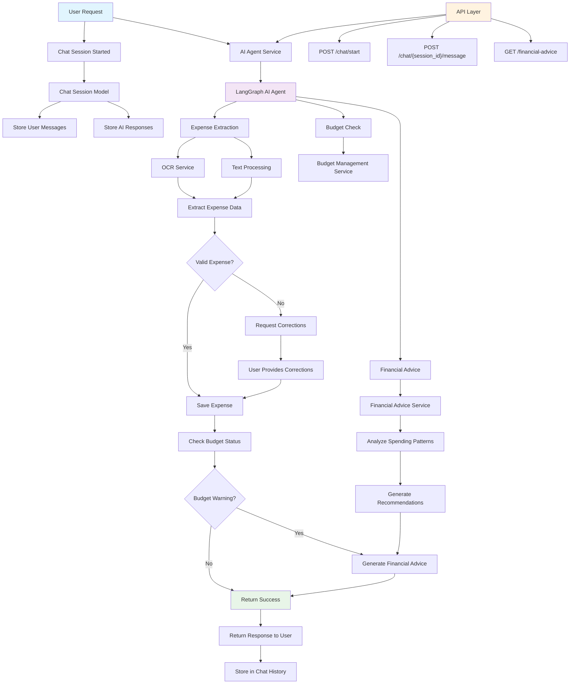
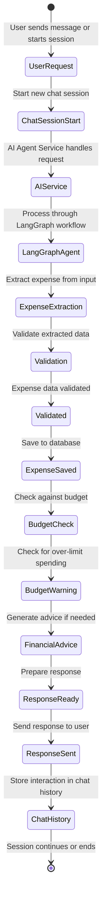
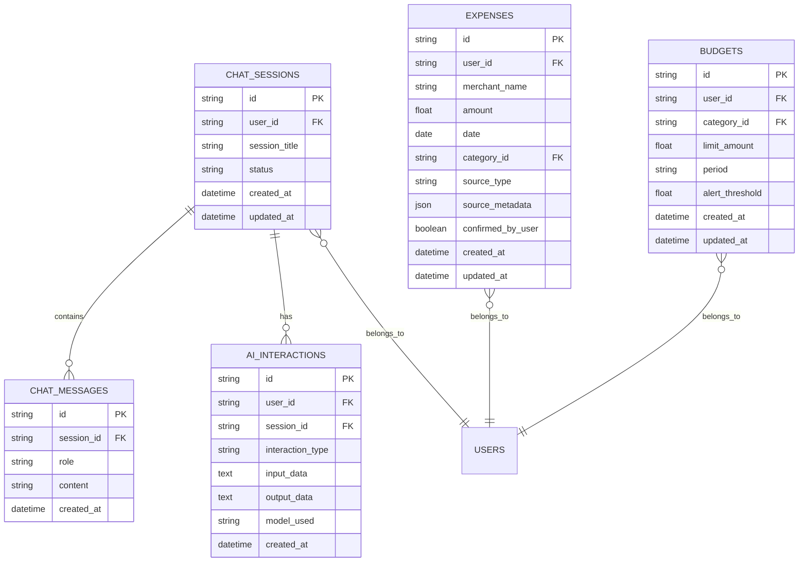

```mermaid
graph TD
    A[User Request] --> B[AI Agent Service]
    A --> C[Chat Session Started]
    
    B --> D[LangGraph AI Agent]
    C --> E[Chat Session Model]
    E --> F[Store User Messages]
    E --> G[Store AI Responses]
    
    D --> H[Expense Extraction]
    D --> I[Budget Check]
    D --> J[Financial Advice]
    
    H --> K[OCR Service] 
    H --> L[Text Processing]
    
    I --> M[Budget Management Service]
    J --> N[Financial Advice Service]
    
    K --> O[Extract Expense Data]
    L --> O
    
    O --> P{Valid Expense?}
    P -->|Yes| Q[Save Expense]
    P -->|No| R[Request Corrections]
    
    Q --> S[Check Budget Status]
    R --> T[User Provides Corrections]
    T --> Q
    
    S --> U{Budget Warning?}
    U -->|Yes| V[Generate Financial Advice]
    U -->|No| W[Return Success]
    V --> W
    
    W --> X[Return Response to User]
    X --> Y[Store in Chat History]
    
    N --> Z[Analyze Spending Patterns]
    Z --> AA[Generate Recommendations]
    AA --> V
    
    BB[API Layer] --> B
    BB --> CC[POST /chat/start]
    BB --> DD["POST /chat/{session_id}/message"]
    BB --> EE[GET /financial-advice]
    
    style A fill:#e1f5fe
    style D fill:#f3e5f5
    style W fill:#e8f5e8
    style BB fill:#fff3e0
```

```mermaid
stateDiagram-v2
    [*] --> UserRequest: User sends message or starts session
    UserRequest --> ChatSessionStart: Start new chat session
    ChatSessionStart --> AIService: AI Agent Service handles request
    AIService --> LangGraphAgent: Process through LangGraph workflow
    LangGraphAgent --> ExpenseExtraction: Extract expense from input
    ExpenseExtraction --> Validation: Validate extracted data
    Validation --> Validated: Expense data validated
    Validated --> ExpenseSaved: Save to database
    ExpenseSaved --> BudgetCheck: Check against budget
    BudgetCheck --> BudgetWarning: Check for over-limit spending
    BudgetWarning --> FinancialAdvice: Generate advice if needed
    FinancialAdvice --> ResponseReady: Prepare response
    ResponseReady --> ResponseSent: Send response to user
    ResponseSent --> ChatHistory: Store interaction in chat history
    ChatHistory --> [*]: Session continues or ends
```

```mermaid
erDiagram
    CHAT_SESSIONS {
        string id PK
        string user_id FK
        string session_title
        string status
        datetime created_at
        datetime updated_at
    }
    
    CHAT_MESSAGES {
        string id PK
        string session_id FK
        string role
        string content
        datetime created_at
    }
    
    AI_INTERACTIONS {
        string id PK
        string user_id FK
        string session_id FK
        string interaction_type
        text input_data
        text output_data
        string model_used
        datetime created_at
    }
    
    EXPENSES {
        string id PK
        string user_id FK
        string merchant_name
        float amount
        date date
        string category_id FK
        string source_type
        json source_metadata
        boolean confirmed_by_user
        datetime created_at
        datetime updated_at
    }
    
    BUDGETS {
        string id PK
        string user_id FK
        string category_id FK
        float limit_amount
        string period
        float alert_threshold
        datetime created_at
        datetime updated_at
    }
    
    CHAT_SESSIONS ||--o{ CHAT_MESSAGES : contains
    CHAT_SESSIONS ||--o{ AI_INTERACTIONS : has
    CHAT_SESSIONS }o--|| USERS : belongs_to
    EXPENSES }o--|| USERS : belongs_to
    BUDGETS }o--|| USERS : belongs_to
```