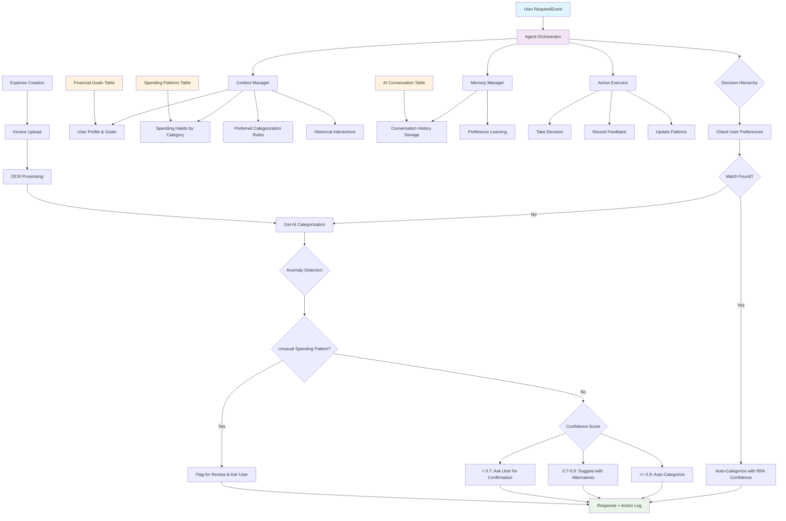
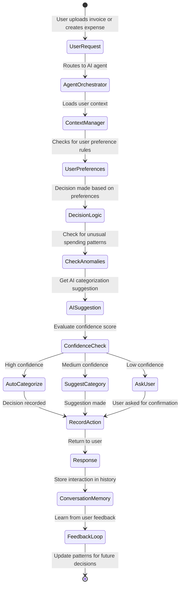
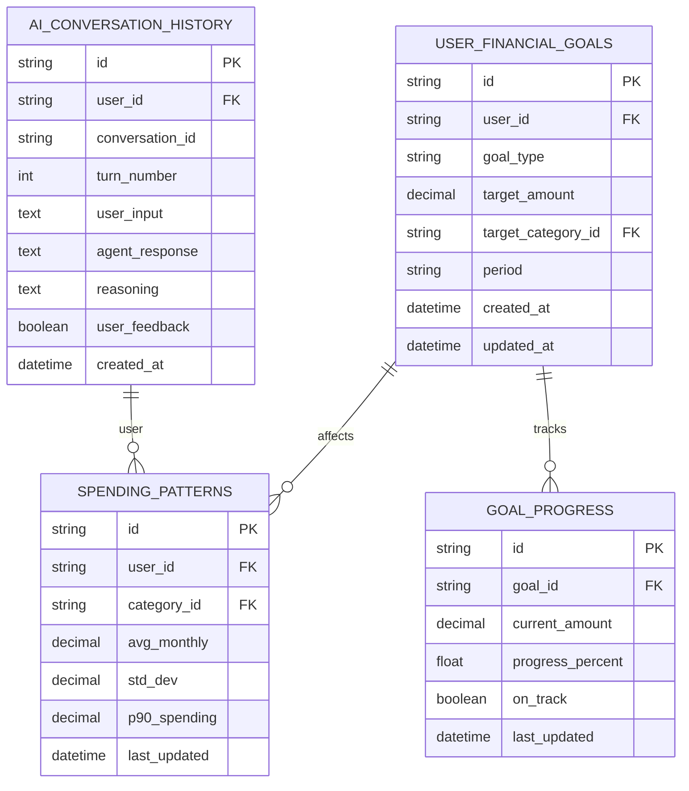

```mermaid
graph TD
    A[User Request/Event] --> B[Agent Orchestrator]
    
    B --> C{Decision Hierarchy}
    
    C --> D[Check User Preferences]
    D --> E{Match Found?}
    E -->|Yes| F[Auto-Categorize with 95% Confidence]
    E -->|No| G[Get AI Categorization]
    
    G --> H{Anomaly Detection}
    H --> I{Unusual Spending Pattern?}
    I -->|Yes| J[Flag for Review & Ask User]
    I -->|No| K{Confidence Score}
    
    K --> L[>= 0.9: Auto-Categorize]
    K --> M[0.7-0.9: Suggest with Alternatives]
    K --> N[< 0.7: Ask User for Confirmation]
    
    B --> O[Context Manager]
    O --> P[User Profile & Goals]
    O --> Q[Spending Habits by Category]
    O --> R[Preferred Categorization Rules]
    O --> S[Historical Interactions]
    
    B --> T[Memory Manager]
    T --> U[Conversation History Storage]
    T --> V[Preference Learning]
    
    B --> W[Action Executor]
    W --> X[Take Decision]
    W --> Y[Record Feedback]
    W --> Z[Update Patterns]
    
    F --> AA[Response + Action Log]
    L --> AA
    M --> AA
    N --> AA
    J --> AA
    
    BB[OCR Processing] --> G
    CC[Invoice Upload] --> BB
    DD[Expense Creation] --> CC
    
    EE[AI Conversation Table] --> U
    FF[Financial Goals Table] --> P
    GG[Spending Patterns Table] --> Q
    
    style A fill:#e1f5fe
    style B fill:#f3e5f5
    style AA fill:#e8f5e8
    style EE fill:#fff3e0
    style FF fill:#fff3e0
    style GG fill:#fff3e0
```

```mermaid
stateDiagram-v2
    [*] --> UserRequest: User uploads invoice or creates expense
    UserRequest --> AgentOrchestrator: Routes to AI agent
    AgentOrchestrator --> ContextManager: Loads user context
    ContextManager --> UserPreferences: Checks for user preference rules
    UserPreferences --> DecisionLogic: Decision made based on preferences
    
    DecisionLogic --> CheckAnomalies: Check for unusual spending patterns
    CheckAnomalies --> AISuggestion: Get AI categorization suggestion
    AISuggestion --> ConfidenceCheck: Evaluate confidence score
    
    ConfidenceCheck --> AutoCategorize: High confidence
    ConfidenceCheck --> SuggestCategory: Medium confidence
    ConfidenceCheck --> AskUser: Low confidence
    
    AutoCategorize --> RecordAction: Decision recorded
    SuggestCategory --> RecordAction: Suggestion made
    AskUser --> RecordAction: User asked for confirmation
    RecordAction --> Response: Return to user
    
    Response --> ConversationMemory: Store interaction in history
    ConversationMemory --> FeedbackLoop: Learn from user feedback
    FeedbackLoop --> [*]: Update patterns for future decisions
```

```mermaid
erDiagram
    AI_CONVERSATION_HISTORY {
        string id PK
        string user_id FK
        string conversation_id
        int turn_number
        text user_input
        text agent_response
        text reasoning
        boolean user_feedback
        datetime created_at
    }
    
    USER_FINANCIAL_GOALS {
        string id PK
        string user_id FK
        string goal_type
        decimal target_amount
        string target_category_id FK
        string period
        datetime created_at
        datetime updated_at
    }
    
    GOAL_PROGRESS {
        string id PK
        string goal_id FK
        decimal current_amount
        float progress_percent
        boolean on_track
        datetime last_updated
    }
    
    SPENDING_PATTERNS {
        string id PK
        string user_id FK
        string category_id FK
        decimal avg_monthly
        decimal std_dev
        decimal p90_spending
        datetime last_updated
    }
    
    AI_CONVERSATION_HISTORY ||--o{ SPENDING_PATTERNS : user
    USER_FINANCIAL_GOALS ||--o{ GOAL_PROGRESS : tracks
    USER_FINANCIAL_GOALS ||--o{ SPENDING_PATTERNS : affects
```