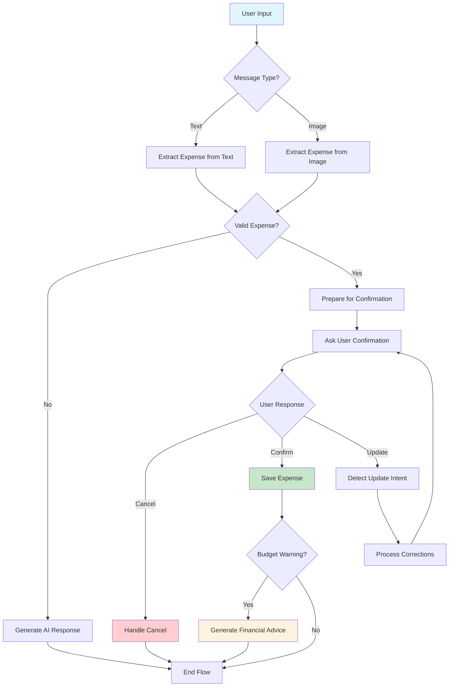

# Luồng Hoạt Động của AI Agent trong Moniagent

## Giải thích luồng hoạt động

1. **User Input**: Người dùng nhập tin nhắn hoặc tải ảnh hóa đơn
2. **Message Type**: Hệ thống xác định loại tin nhắn (văn bản hoặc hình ảnh)
3. **Extract Expense**: Trích xuất thông tin chi tiêu từ tin nhắn/ảnh
4. **Valid Expense**: Kiểm tra xem có trích xuất được thông tin hợp lệ không
5. **Prepare Confirmation**: Chuẩn bị thông tin để xác nhận với người dùng
6. **Ask Confirmation**: Hỏi người dùng xác nhận thông tin chi tiêu
7. **User Response**: Người dùng có thể:
   - Xác nhận (Confirm)
   - Hủy (Cancel) 
   - Yêu cầu cập nhật (Update)
8. **Process Corrections**: Xử lý các thay đổi người dùng yêu cầu
9. **Save Expense**: Lưu chi tiêu vào database
10. **Budget Warning**: Kiểm tra cảnh báo ngân sách
11. **Generate Financial Advice**: Tạo lời khuyên tài chính nếu có cảnh báo
12. **End Flow**: Kết thúc luồng xử lý

## Các thành phần chính

- **LangGraph Agent**: Quản lý luồng trò chuyện và trạng thái
- **Expense Processing Service**: Xử lý trích xuất chi tiêu
- **Budget Management Service**: Quản lý ngân sách và cảnh báo
- **Financial Advice Service**: Tạo lời khuyên tài chính
- **OCR Service**: Nhận dạng văn bản từ ảnh hóa đơn