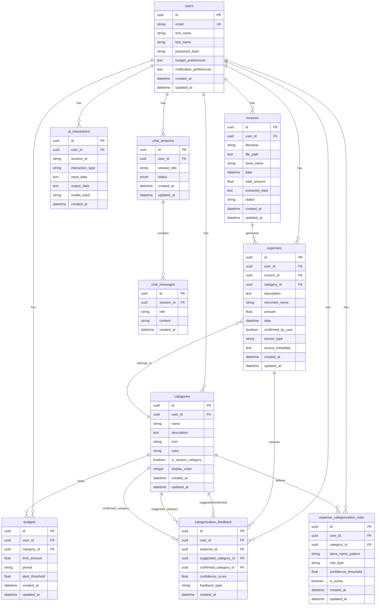

# Moniagent Database Schema Diagram

## Entity Relationship Diagram

## Table Descriptions

### Core Tables

#### `users`
Central user table storing authentication and preferences
- **Primary Key**: `id` (UUID)
- **Unique Constraint**: `email`
- **Relationships**: One-to-many with all user-specific data

#### `invoices`
Stores uploaded invoice images and extracted data
- **Status**: pending, processed, failed
- **Links**: Belongs to user, generates expenses

#### `expenses`
Main expense tracking table
- **Source Types**: "image" (from invoice) or "text" (manual entry)
- **Confirmation**: User can confirm AI-extracted information
- **Links**: Belongs to user, category, and optionally invoice

#### `categories`
Expense categorization with system and user-defined categories
- **Types**: System categories (predefined) vs user categories
- **Display**: Ordered by `display_order` with custom icons/colors

### Budget & Rules Tables

#### `budgets`
Budget limits per category per user
- **Periods**: monthly, weekly, yearly
- **Alerts**: Triggers at `alert_threshold` percentage

#### `expense_categorization_rules`
Auto-categorization rules based on merchant patterns
- **Rule Types**: keyword, regex, exact_match
- **Confidence**: Minimum threshold for auto-application

### AI & Chat Tables

#### `ai_interactions`
Logs all AI interactions for debugging and analytics
- **Types**: invoice_processing, categorization, advice
- **Optional**: Can log interactions for unauthenticated users

#### `chat_sessions` & `chat_messages`
Conversational AI chat functionality
- **Session Status**: active, completed, archived
- **Message Roles**: user, assistant

### Learning Tables

#### `categorization_feedback`
Machine learning feedback loop for categorization improvement
- **Feedback Types**: confirmation, correction
- **Dual Category Links**: Tracks both suggested and confirmed categories

## Key Relationships

1. **User-Centric**: All data belongs to a user with cascade delete
2. **Invoice → Expense**: One invoice can generate multiple expenses
3. **Expense → Category**: Many-to-one relationship with optional categorization
4. **Budget → Category**: One budget per category per user
5. **Learning Loop**: Expenses → Feedback → Rules → Categories

## Data Flow

1. **Invoice Upload** → `invoices` table → AI processing → `expenses` table
2. **Expense Categorization** → AI suggestion → User feedback → `categorization_feedback`
3. **Rule Learning** → Feedback patterns → `expense_categorization_rules`
4. **Budget Monitoring** → Expenses vs `budgets` → Alert thresholds
5. **Chat Interactions** → `chat_sessions` → `chat_messages` → `ai_interactions` logging